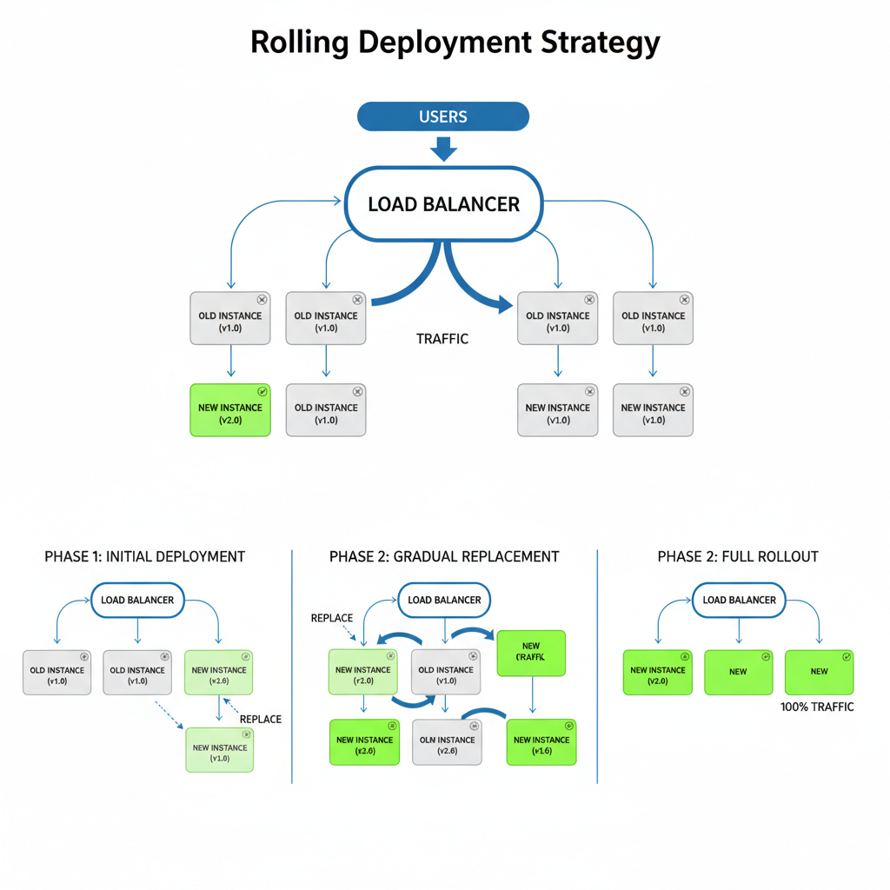
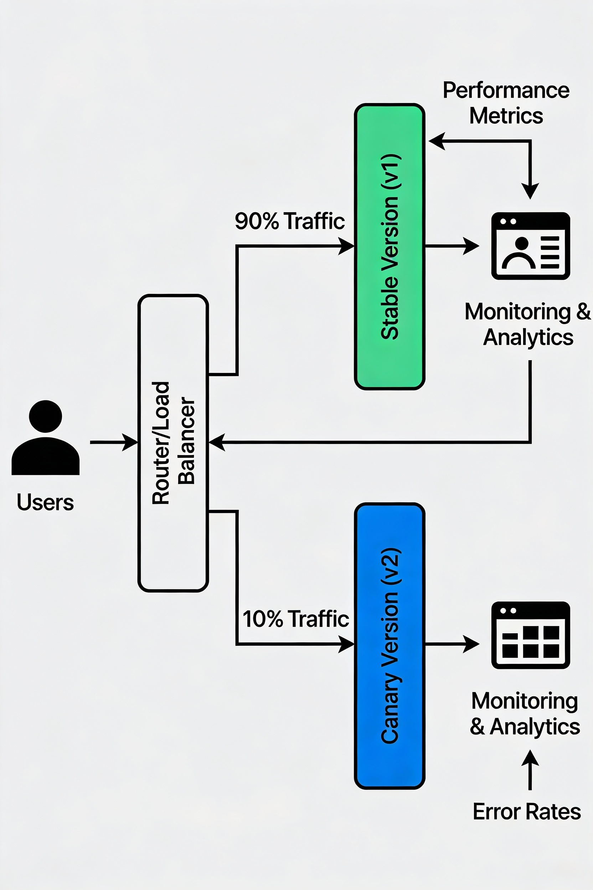

+++
date = '2025-10-23T20:36:07-04:00'
draft = false
title = 'Choosing the Right Deployment Strategy: A DevOps Perspective'
+++

Getting your code to production shouldn't feel like launching a rocket. Different strategies fit different situations, and knowing which one to reach for can mean the difference between a smooth Friday afternoon and a chaotic one. Let's break down the most common release strategies and help you pick the right fit for your team.

## Release vs Deployment: What's the Difference?

Before we dive into the strategies, let's clear up what we mean by these terms because they're often used interchangeably but they're not quite the same thing.

**Deployment** is the technical process of moving code to a server. It's pushing bits from point A to point B. Think of it as the mechanics of getting your application running on infrastructure.

**Release** is the business decision to make something available to users. You might deploy multiple times before you actually release to customers, or you might release something that's been deployed for days. Release is about user visibility and impact.

In practice, DevOps has blurred these lines with continuous deployment strategies that automate much of the deployment process, but the distinction still matters when you're planning your rollout.

## Recreate Deployment: The Clean Slate Approach

This is the simplest strategy and sometimes the best one. You stop all the old instances, then start all the new ones. It's straightforward but comes with downtime.

Recreate deployment works like this:

Old version is running. You take everything offline. New version starts. Users see a brief interruption.

When should you use it? When your application can tolerate a few minutes offline, when you have breaking database schema changes that need to run before the app starts, or for non production environments where you're testing major updates.

The trade off is obvious: you get simplicity and reliability, but you lose availability. Plan your recreation deployment carefully, ideally during low traffic windows, and make sure your team knows when it's happening.

## Rolling Deployments: The Gradual Update



Rolling deployments are the default in Kubernetes for good reason. Instead of taking everything down, you update a few instances at a time while the rest handle traffic. It's like replacing the engine of a car while it's still driving.

Here's how it works:

You have 10 instances running version 1.0. You spin up 2 new instances running version 2.0. Once they're healthy, you start routing traffic to them. You shut down 2 old instances. You repeat this process until all instances are on version 2.0.

Throughout this process, users keep getting served by healthy instances. If something goes wrong with the new version, you've only affected a small slice of your traffic. Kubernetes handles most of this automatically through its rolling update mechanism.

Rolling deployments are your go to for most applications. They give you continuous availability, allow for quick rollbacks if needed, and work well with health checks that validate each batch before moving forward.

The catch? It takes longer than a blue green deployment, and you need to handle database migrations carefully since you might have two versions talking to the same database.

## Canary Deployment: Real World Testing



Canary deployments take the rolling approach and add validation. You deploy the new version to a small percentage of users (say 5%), monitor it intensely, and if all looks good, gradually increase the traffic.

The process:

New version goes live to 5% of users. Your monitoring systems watch for errors, latency spikes, and any other anomalies. If everything is stable after an hour, bump it to 25%. After another hour, 50%. Keep going until 100%.

This strategy is perfect for major features or risky updates. You get early warning signals from real users with minimal blast radius. You also get valuable feedback before full rollout. If you spot an issue at 5%, you've only impacted a tiny slice of users instead of everyone.

The downside is complexity. You need sophisticated monitoring, traffic routing, and the ability to roll back quickly. You also need to think about how long to stay at each percentage, what metrics trigger a rollout pause, and how to handle persistent state across versions.

## Blue Green Deployments: The Safe Swap


Blue green deployment maintains two complete, identical production environments. At any moment, one is active (blue) handling traffic, and one is inactive (green). When you're ready to release, you deploy to green, run all your tests there, then flip traffic to green. If something breaks, you flip back to blue.

The flow:

Blue is live with version 1.0. You deploy version 2.0 to green. Green gets smoke tested, health checked, and validated. Load balancer switches all traffic from blue to green. Green is now live.

If users report issues, you flip the switch back to blue in seconds. Blue green deployments give you the fastest rollback possible and let you test thoroughly before going live. There's no version mixing during the transition since you completely switch environments at once.

The trade off is resource intensive. You need double the infrastructure to run both environments. It also doesn't work well for applications with stateful components unless you handle session synchronization carefully. And if your deployment process takes an hour, you're sitting with green fully deployed before switchover, which can feel risky if the code is ready but not actually handling production traffic.

## Shadow Deployments: The Silent Observer

Shadow deployments run the new version alongside production but send it a copy of real traffic without affecting actual users. You're essentially testing against production data without production consequences.

How it works:

Production traffic comes in. Load balancer routes real traffic to the current version. Simultaneously, a copy of that traffic goes to the new version. Both versions process the request. Users only see the response from the current version.

You monitor both versions and compare results. Are response times comparable? Are error rates the same? If the shadow version crashes, users don't see it. If it's slower, users don't experience it. You're getting real world validation with zero risk.

Shadow deployments are ideal when you need high confidence before switching, when you want to validate against production scale and real data patterns, or when you're making subtle changes that need validation under actual conditions.

The complexity comes in traffic duplication, ensuring the shadow system can't write to production systems or trigger side effects, and comparing two streams of data for discrepancies. You also need solid monitoring to surface what the shadow version is doing.

## What Are Feature Flags and How Are They Used?

Feature flags (sometimes called feature toggles) are perhaps the most underrated tool in modern DevOps. They're simple: a piece of code that says "if this flag is on, do this. If it's off, do that."

The magic is decoupling deployment from release. You deploy code to production with a feature flag turned off. The code is there, the feature doesn't run. No users see it. You can then flip the flag on at 2 AM for your internal team, watch it work, and gradually enable it for users without redeploying anything.

Feature flags enable:

**Progressive rollouts:** Release to 10% of users, then 50%, then 100%, all with a flag toggle.

**Instant rollbacks:** A feature causing problems? Flip the flag off and it stops running immediately. Much faster than a code rollback and redeployment.

**AB testing:** Run two versions of a feature for different user segments and measure which performs better.

**Reducing deployment risk:** You can deploy constantly without releasing constantly. Feature flags separate these concerns.

**Safe development:** Teams can merge work in progress to the main branch with flags off, reducing merge conflicts and enabling continuous integration.

Common uses look like this:

```python
if feature_flag('new_checkout_flow'):
    # Use the new checkout experience
    return new_checkout()
else:
    # Fall back to proven flow
    return legacy_checkout()
```

You typically use a feature flag service like LaunchDarkly, Unleash, or even a simple database. These let you control which users see which flags without code changes. You can target by user ID, geography, user cohort, or whatever criteria matter.

The best part? Feature flags work alongside any other strategy. You can use feature flags with rolling deployments, canary releases, or blue green switching. They make everything safer by giving you a quick kill switch.

## Putting It All Together

| Strategy | Downtime | Speed | Complexity | Best For | Risk Level |
|----------|----------|-------|-----------|----------|-----------|
| **Recreate** | Yes | Fast | Low | Scheduled maintenance, breaking schema changes, non production | High |
| **Rolling** | No | Slow | Medium | Most applications, default choice | Low |
| **Canary** | No | Slow | High | High risk features, real world validation needed | Low |
| **Blue/Green** | No | Fast | High | Fastest rollbacks, stateless applications | Low |
| **Shadow** | No | Medium | High | Production scale validation, subtle changes | Low |
| **Feature Flags** | No | Instant | Medium | Decouple deployment from release, AB testing, instant rollbacks | Very Low |

Most teams use multiple strategies depending on the change. A risky new payment flow might warrant canary deployment. A bug fix might just be a rolling update with a feature flag kill switch. Database schema changes might need careful planning with recreate deployment.

The key is understanding your options and matching them to your risk tolerance and operational constraints.

Hope you found this helpful. Happy hosting!